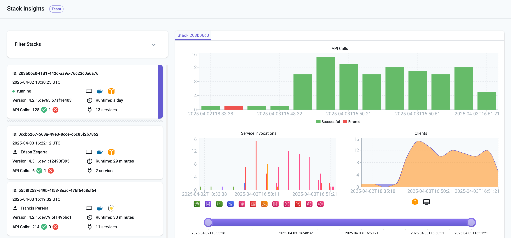

LocalStack allows for transparent collection of execution events, in order to provide usage analytics and insights into the testing process overall. Stack Insights enable LocalStack users to report AWS API usage telemetry of LocalStack runs to their LocalStack account. 

You can see which APIs are being used, which clients of integrations use particular services and API operations, which services cause the most API errors, and much more using Stack Insights. The Stacks widget and detailed Stack information is part of our Pro plan, while the graphical representation currently falls under our Team preview.

To get started, the `LOCALSTACK_API_KEY` environment variable needs to be configured. The system will start making your events accessible on the LocalStack [Web Application dashboard](https://app.localstack.cloud/dashboard).


Data privacy is one of our key concerns, hence data is collected only in an anonymized way. No sensitive information about your application is ever exposed. The data is only used to provide you with insights into the usage of LocalStack and to improve the product.


## Getting started

 To get started with this feature, log in to your [LocalStack account](https://app.localstack.cloud/) and start a [LocalStack instance on your local machine](). The LocalStack Dashboard will show the Stacks widget, which holds most of the vital information of recent and currently running stacks.

The Stack widget will also display the number of API calls, services employed and the runtime duration for each spin-up. All the spin-ups are timestamped; hence you can easily navigate the stacks and check the number of API calls that succeeded and failed.

## Detailed Stack information

 You can click on the individual stack to display detailed information. This includes the number of API calls, service invocations, the user agent (`aws-cli`, `terraform` etc.) and the particular service called in the specific spin-up. You can also use the slide toggle to pick up a particular time duration during which the user made specific API calls.

## List of events during Stack lifetime

 You can also check the list of events during the entire Stack life-time, which includes the Service, operation, Status Code, Server time and the User-agent.

## Configuration

You can disable event reporting on your LocalStack client by setting the environment variable `DISABLE_EVENTS=1`.

{}
Brave blocks `localhost` requests due to security by default via shields. While some sites need access to `localhost` / `127.0.0.1` to work correctly, an easy option to allow a user to enable this is manually enabling via the site via `brave://settings/content/insecureContent`.
{}

