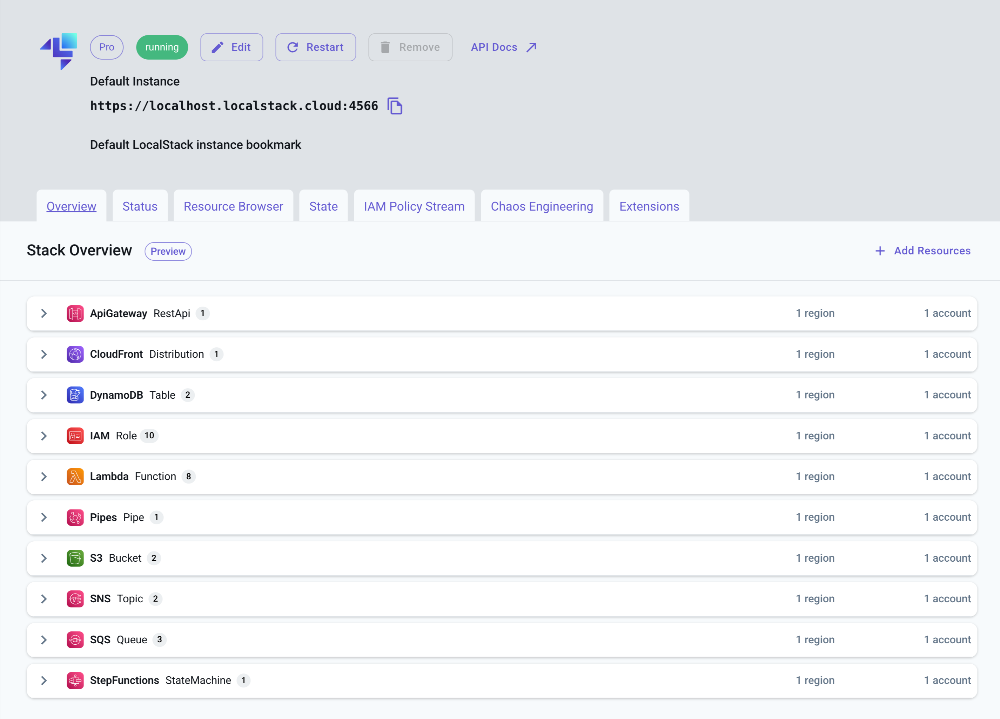

## Introduction

The Stack Overview provides a summary of deployed resources, categorized services with configurations, and quick access to resource details like identifiers and endpoints.

You can access the Stack Overview in the [LocalStack Web Application](https://app.localstack.cloud/inst/default/overview).
Alternatively, go to your LocalStack Instance and click on **Overview** to see a high-level visualization of your locally running cloud app architecture.

 
 


Stack Overview is offered as a **preview** feature and is under active development.


## Supported Resources

The following resources are supported by Stack Overview:

1. [`AWS::ApiGateway::RestApi`](https://docs.aws.amazon.com/AWSCloudFormation/latest/UserGuide/aws-resource-apigateway-restapi.html)
2. [`AWS::CloudFormation::Stack`](https://docs.aws.amazon.com/AWSCloudFormation/latest/UserGuide/aws-resource-cloudformation-stack.html)
3. [`AWS::DynamoDB::Table`](https://docs.aws.amazon.com/AWSCloudFormation/latest/UserGuide/aws-resource-dynamodb-table.html)
4. [`AWS::EC2::VPC`](https://docs.aws.amazon.com/AWSCloudFormation/latest/UserGuide/aws-resource-ec2-vpc.html)
5. [`AWS::Events::EventBus`](https://docs.aws.amazon.com/AWSCloudFormation/latest/UserGuide/aws-resource-events-eventbus.html)
6. [`AWS::IAM::Group`](https://docs.aws.amazon.com/AWSCloudFormation/latest/UserGuide/aws-resource-iam-group.html)
7. [`AWS::IAM::Role`](https://docs.aws.amazon.com/AWSCloudFormation/latest/UserGuide/aws-resource-iam-role.html)
8. [`AWS::IAM::User`](https://docs.aws.amazon.com/AWSCloudFormation/latest/UserGuide/aws-resource-iam-user.html)
9. [`AWS::Lambda::Function`](https://docs.aws.amazon.com/AWSCloudFormation/latest/UserGuide/aws-resource-lambda-function.html)
10. [`AWS::S3::Bucket`](https://docs.aws.amazon.com/AWSCloudFormation/latest/UserGuide/aws-resource-s3-bucket.html)
11. [`AWS::SES::EmailIdentity`](https://docs.aws.amazon.com/AWSCloudFormation/latest/UserGuide/aws-resource-ses-emailidentity.html)
12. [`AWS::SNS::Topic`](https://docs.aws.amazon.com/AWSCloudFormation/latest/UserGuide/aws-resource-sns-topic.html)
13. [`AWS::SQS::Queue`](https://docs.aws.amazon.com/AWSCloudFormation/latest/UserGuide/aws-resource-sqs-queue.html)
14. [`AWS::SSM::Parameter`](https://docs.aws.amazon.com/AWSCloudFormation/latest/UserGuide/aws-resource-ssm-parameter.html)
15. [`AWS::SecretsManager::Secret`](https://docs.aws.amazon.com/AWSCloudFormation/latest/UserGuide/aws-resource-secretsmanager-secret.html)
16. [`AWS::StepFunctions::StateMachine`](https://docs.aws.amazon.com/AWSCloudFormation/latest/UserGuide/aws-resource-stepfunctions-statemachine.html)
17. [`AWS::CloudFront::Distribution`](https://docs.aws.amazon.com/AWSCloudFormation/latest/UserGuide/aws-resource-cloudfront-distribution.html)
18. [`AWS::Pipes::Pipe`](https://docs.aws.amazon.com/AWSCloudFormation/latest/UserGuide/aws-resource-pipes-pipe.html)
