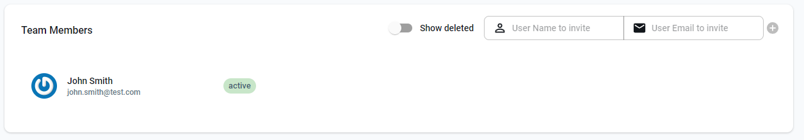
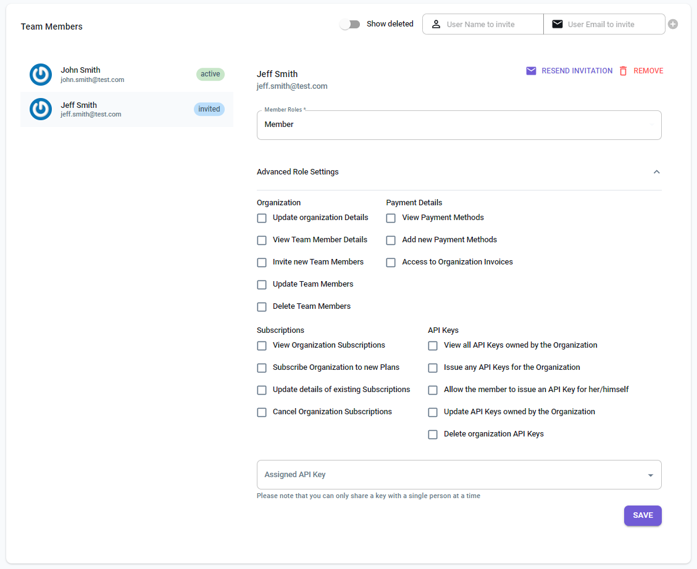

Teams on LocalStack allow you to collaborate with members of your organization. You can invite other users to your team and assign them different roles and permissions. It includes advanced role settings such as purchasing subscriptions, managing payment methods, and more, which can be adjusted by the team administrator. You can purchase a plan with multiple seats for your team, which allows you to distribute the API keys among your team members.

{}
Organizations/Teams are used interchangeably within our Web Application.
{}

#### Inviting Team Members

To invite team members, navigate to the [**app.localstack.cloud/account/members**](https://app.localstack.cloud/account/members) section of your profile. You will be prompted to enter the **User Name** and **Email Address** of the team member you wish to invite. Once you have entered the details, click on the plus symbol (`+`) to invite them to your team.

#### Member Roles & API Keys

After a team member has been invited, you can assign them different roles and permissions. You can also assign them an API key, which will allow them to access the LocalStack Web Application and the Pro CLI (command line interface).

To access the API key, the members must navigate to the [**app.localstack.cloud/account/apikeys**](https://app.localstack.cloud/account/apikeys) section of their profile.
