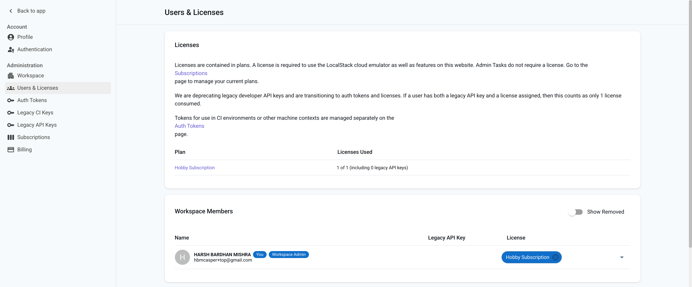
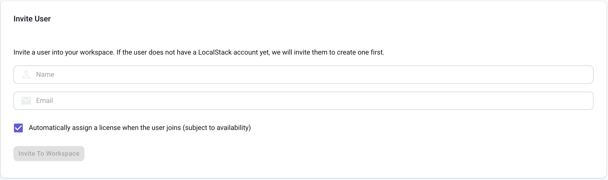

## Introduction

The **Users & Licenses** page in the LocalStack Web Application allows workspace administrators to manage user memberships, assign licenses, and transition users from legacy API keys to the new license system.

To access this page:
1. Click on your name in the top-left corner of the dashboard.
2. Go to **Settings** → **Users & Licenses** under the **Administration** section.

## Managing Users

### Inviting Users

To invite someone to your workspace:

- Go to the **Invite User** section.
- Enter the name and email of the user.
- Check the option to automatically assign a license (optional).
- Click **Invite To Workspace**.

If the invitee does not have a LocalStack account, they will receive an email to create one.

The name entered here is only a placeholder until the user completes signup.


Only workspace admins can invite users and manage license assignments.


### Removing Users

To remove a user from the workspace:

- Click on the user entry to expand their details.
- Click **Remove User from Workspace**.

You can re-invite them anytime.

### Managing Roles and Permissions

Click on a user’s entry to view and edit their role.

- Set them as **Admin** or **Member**
- Configure advanced permissions if available

## Managing Licenses

Licenses are part of subscription plans and are shown under the **Licenses** section.

- To **assign** a license: Use the dropdown next to a user in the members list.
- To **unassign** a license: Click the `x` on the license badge next to the user.
- A license can be reassigned at any time.

Changes apply immediately and don’t require user action.

## Migrating from Legacy API Keys

Previously, access was granted via personal developer API keys.

### Why move to Auth Tokens?

- Auth Tokens are more secure and rotate-friendly.
- Admins can manage licenses without the user needing to change configurations.
- Users authenticate once with the token; the license is linked automatically.

### Migration Process

1. Go to the **Workspace Members** list.
2. Assign a license to a user.
3. Ask the user to switch their config to use an **Auth Token** (available in the **Auth Tokens** page).
4. Remove the legacy API key once the Auth Token is in use.


If a user has both a legacy API key and a license, it only counts as **one** active license



### Deprecation Notice

Legacy API keys are still supported for now, but will be phased out over the coming months.
We recommend migrating to licenses and Auth Tokens as soon as possible.
