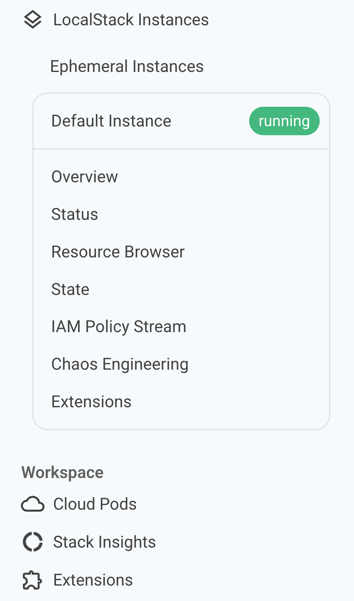
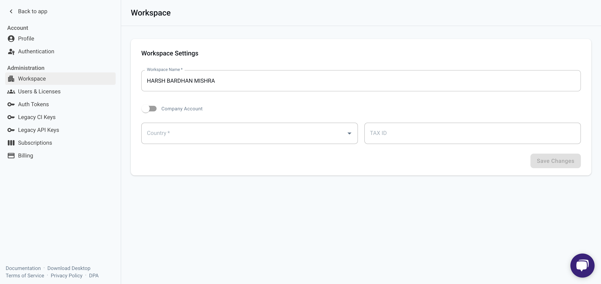

## Introduction

In LocalStack, a **Workspace** is the foundational unit for organizing users, resources, and billing.

It enables collaboration across teams and provides access to shared capabilities.

## Workspace Features

These include:

- **Cloud Pods** : Manage and share your state snapshots.
- **Stack Insights**: Monitor and observe your LocalStack usage.
- **Extensions**: Access the Extensions Library.

You can find these under the **Workspace** section in the left sidebar.

## Workspace Settings

Workspace settings can be accessed by clicking your or your organization's name in the top-left corner → **Settings** → **Workspace**.

Here, administrators can configure and manage:

- Workspace name
- Company account status
- Country and Tax ID
- User and license management
- Authentication tokens
- Subscriptions and billing
- Legacy CI/API keys (if applicable)

These options are available under the **Administration** section.

